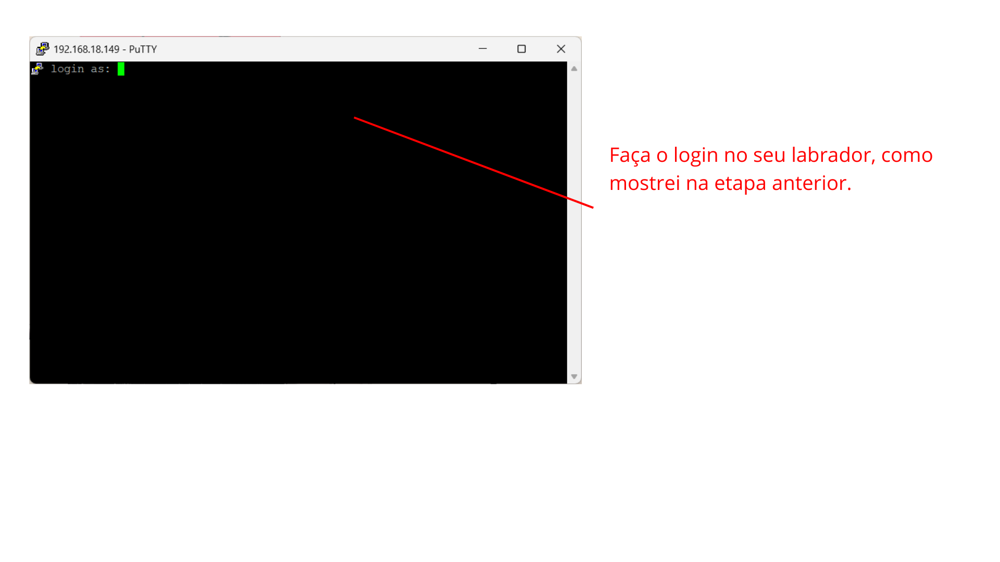
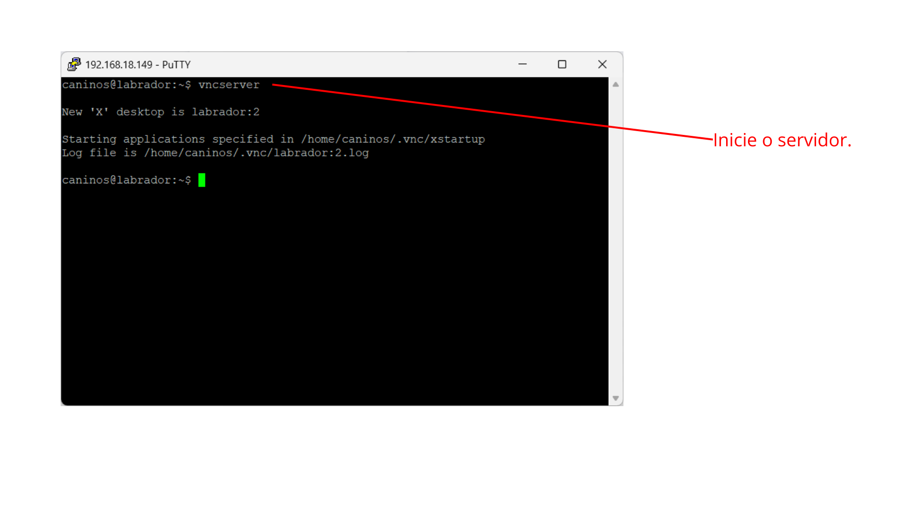
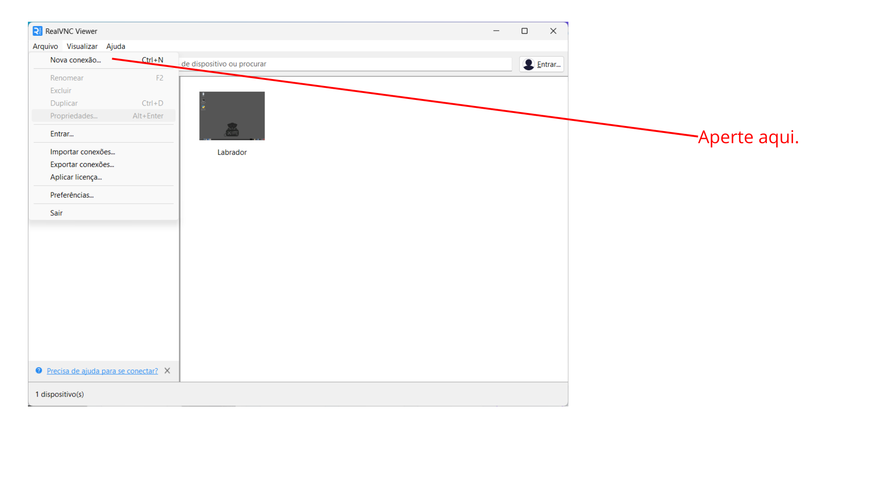
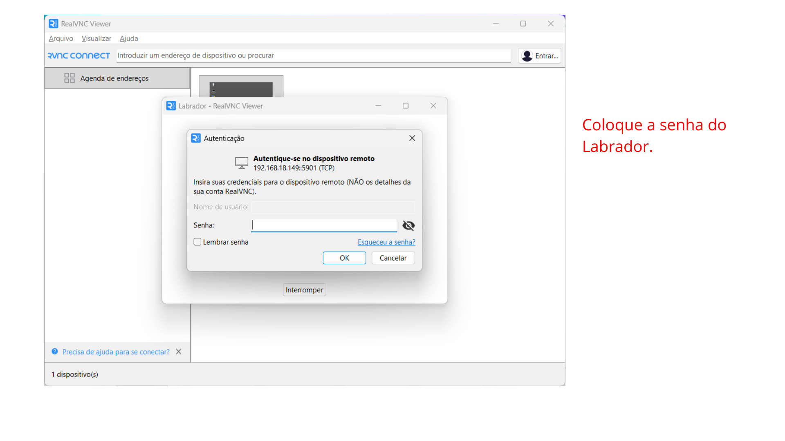

# Documentação RealVNC & Labrador

Para que serve? Image que você não tenha um monitor externo extra para ver a tela do labrador... Você deve estar pensando, como posso realizar meus projetos assim? É fácil, vamos resolver isso e te mostrar como controlar remotamente o seu labrador via VNC Server.

Vídeo complementar: https://youtu.be/9YCLG-LLUZI?si=j1yIBMnHUsgcHXrc

### Demonstração:


# Vamos começar baixando o VNCServer

1. Baixe o VNCServer:


---


# Entre no Putty 

1. Estabeleça conexão com o Labrador via SSH para a instalação de depedências



---


Comandos:
```python
sudo apt install xfce4 xfce4-goodies
```
```python
sudo apt install tightvncserver
```

---


Comando:

```python
vncserver
```

# Na sua máquina, volte para o programa do VNCServer



--- 


---


---


---

# Pronto, você já pode controlar o Labrador remotamente:

