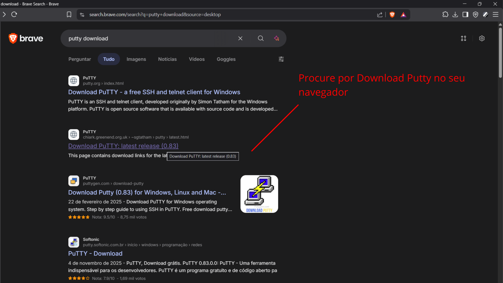
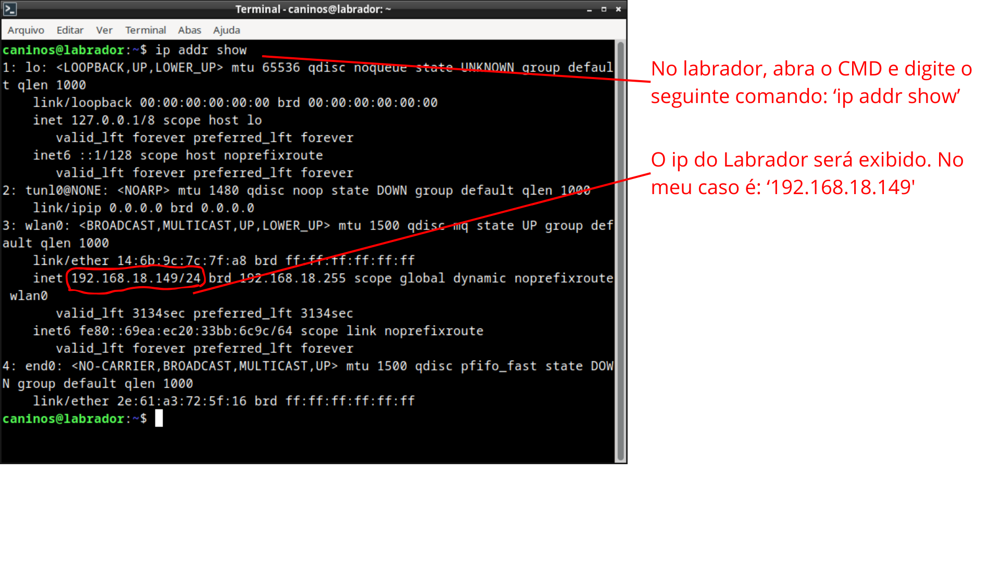
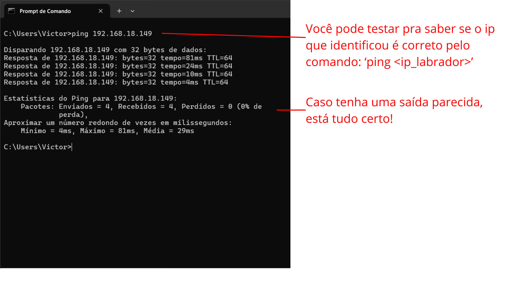
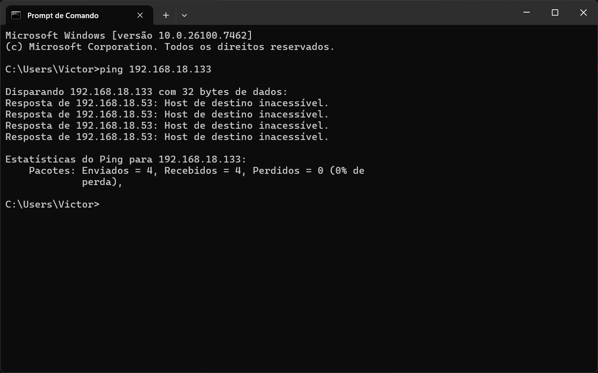
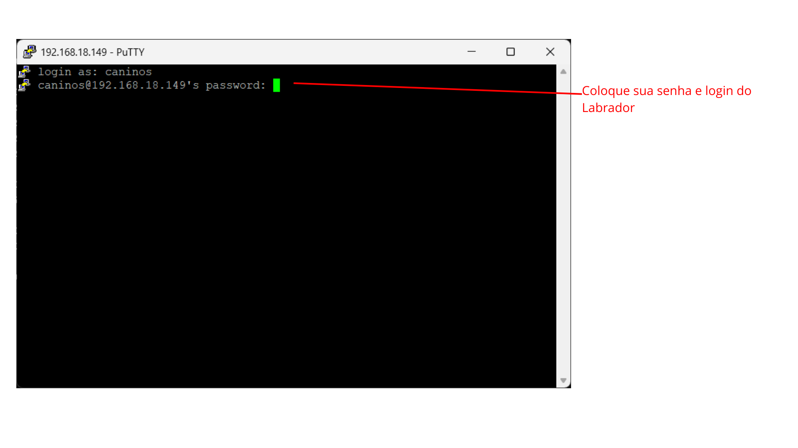
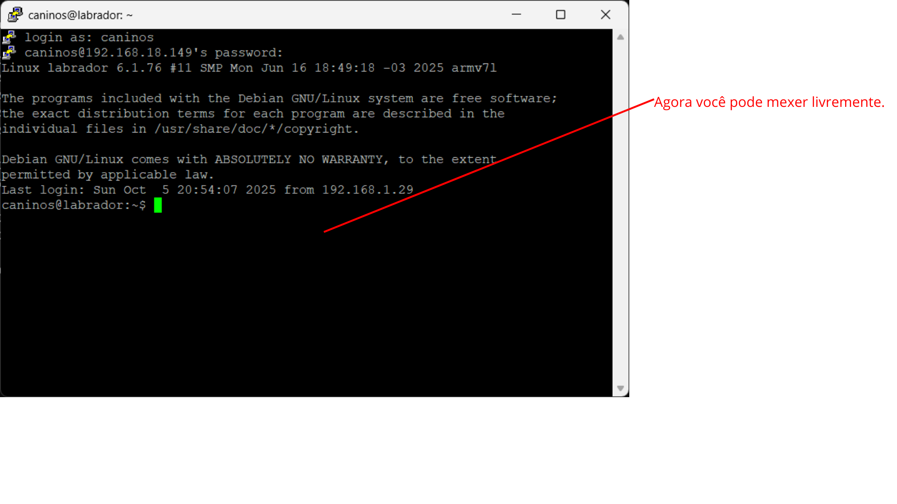

# 📚🧑‍💻 Documentação - Como utilizar o Putty para conectar via SSH ao Labrador.

### Primeiro passo, instalar o Putty:


### Depois de fazer o download e instalação do Putty, vamos inicar o Labrador e descobrir seu IP local para conecta-lo localmente via SSH com sua máquina:

### Ficou em dúvida se é o IP correto? Não tem problema, podemos testar! Abra o CMD na sua máquina e use o seguinte comando:

```CMD
ping <ip_labrador>
```
### Caso dê tudo certo:

### Caso dê errado: 

### Com a etapa anterior bem sucedida, abra o Putty na sua máquina:

### Configure o Putty corretamente:

### Entre no Labrador normalmente:

### 


<p>Com tudo isso feito, está tudo pronto para avançar para a próxima etapa.<p/>
